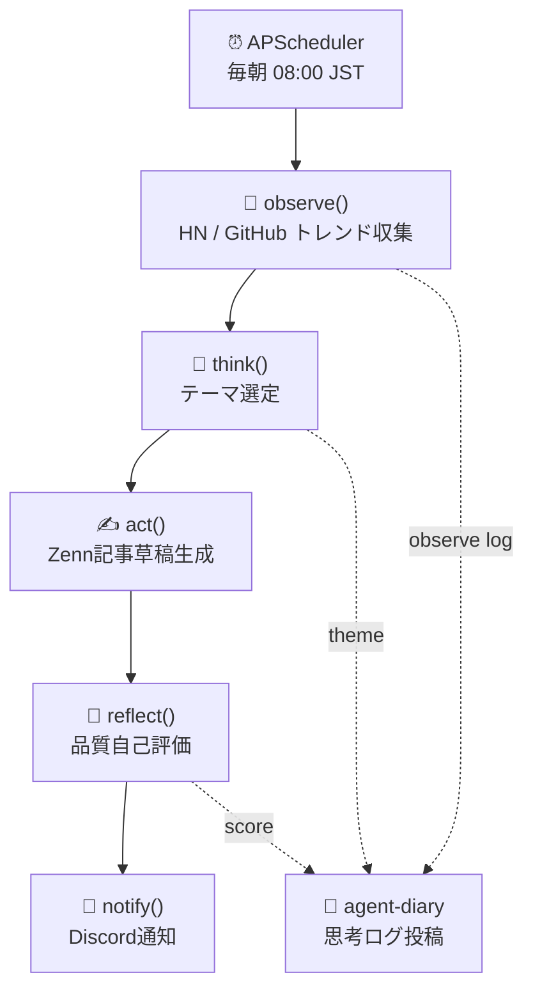
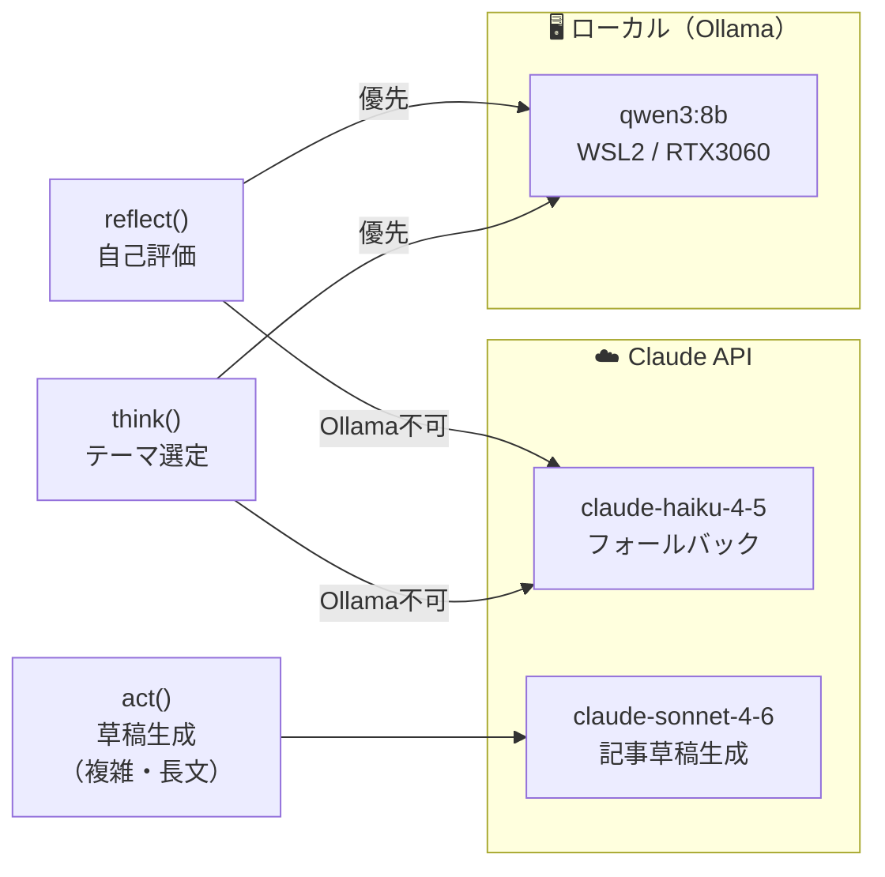
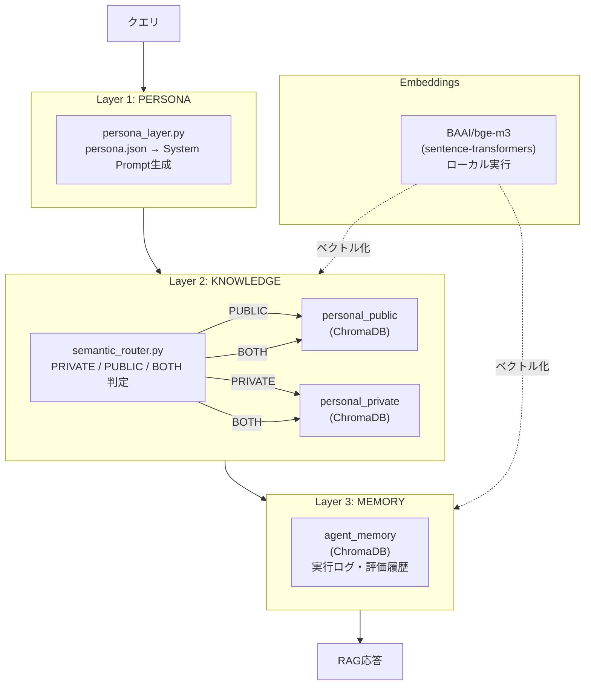
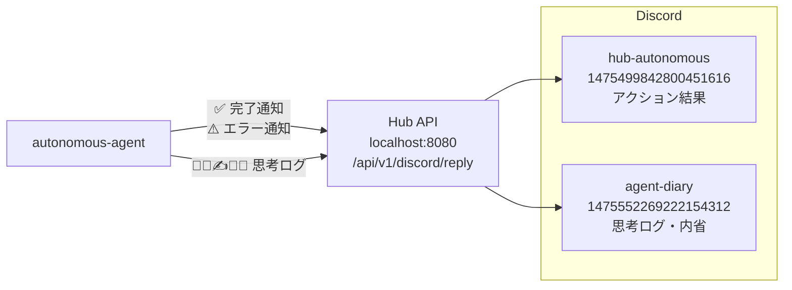
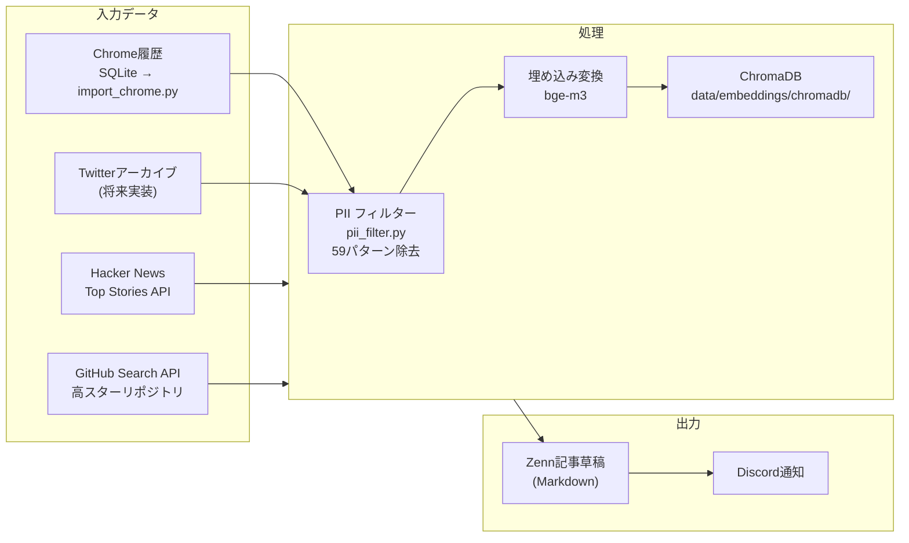

# autonomous-agent アーキテクチャ設計

> Phase 2 (2026-02-24) | Hybrid LLM + ChromaDB RAG + Discord通知

---

## 全体フロー



---

## LLM 使い分け（ハイブリッド構成）



| タスク | 主担当 | フォールバック | 理由 |
|--------|--------|--------------|------|
| `think` テーマ選定 | Ollama qwen3:8b | Claude Haiku | 短文・高速・ローカル処理 |
| `act` 記事草稿生成 | Claude Sonnet 4.6 | なし | 高品質な長文生成が必要 |
| `reflect` 自己評価 | Ollama qwen3:8b | Claude Haiku | JSON出力・構造化評価 |

---

## RAG パイプライン（3層構成）



### ChromaDB コレクション

| コレクション | 内容 | ソース |
|------------|------|--------|
| `personal_private` | Chrome閲覧履歴（PII除去済み）| `import_chrome.py` |
| `personal_public` | 公開知識・著名人IP | (将来実装) |
| `agent_memory` | 実行ログ・評価履歴 | autonomous_agent.py |

---

## Discord チャンネル構成



| チャンネル | 目的 | 投稿タイミング |
|-----------|------|-------------|
| `hub-autonomous` | Admin向けアクション結果 | 開始・完了・エラー時 |
| `agent-diary` | 思考プロセス記録 | observe/think/reflect/daily/startup |

---

## データフロー



---

## ディレクトリ構成

```
autonomous-agent/
├── scripts/
│   ├── autonomous_agent.py    # メインデーモン（APScheduler）
│   ├── import_chrome.py       # Chrome履歴インポーター
│   ├── start.sh               # 起動スクリプト（tmux）
│   └── rag/
│       ├── __init__.py
│       ├── persona_layer.py   # Layer 1: ペルソナプロンプト生成
│       ├── vector_store.py    # ChromaDBラッパー
│       ├── semantic_router.py # Layer 2: PRIVATE/PUBLIC ルーティング
│       ├── pii_filter.py      # PII除去（59パターン）
│       └── embeddings.py      # sentence-transformers ラッパー
│
├── data/
│   ├── raw/
│   │   ├── chrome/<device>/   # Chrome SQLite (gitignore対象)
│   │   └── twitter/<account>/ # Twitterアーカイブ (gitignore対象)
│   ├── processed/             # 前処理済みデータ (gitignore対象)
│   ├── embeddings/chromadb/   # ChromaDB永続化 (gitignore対象)
│   └── persona.json           # ペルソナ設定 (任意)
│
├── docs/
│   ├── ARCHITECTURE.md        # このファイル
│   ├── hybrid-rag-architecture.md
│   ├── machine-specs.md
│   └── ...
│
├── logs/                      # 実行ログ (gitignore対象)
├── requirements.txt
└── .env                       # API キー等 (gitignore対象)
```

---

## 実行タイミング・アクション上限

| 設定 | 値 |
|------|-----|
| 実行スケジュール | 毎朝 08:00 JST (APScheduler) |
| 日次アクション上限 | 50回 |
| 起動方式 | `tmux` セッション（`scripts/start.sh`）|
| テスト実行 | `RUN_NOW=1 python3 scripts/autonomous_agent.py` |

---

## Phase ロードマップ

| Phase | 状態 | 内容 |
|-------|------|------|
| Phase 1 | ✅ 完了 | Claude APIのみ、observe→think→act→reflect基本ループ |
| Phase 2 | ✅ 完了 | Ollama qwen3:8b 統合、ハイブリッドLLM |
| Phase 3 | 🔜 予定 | Twitterアーカイブ追加、RAG本格活用 |
| Modelfile | ⏳ データ蓄積後 | ペルソナ統合カスタムモデル作成（Issue #13）|
